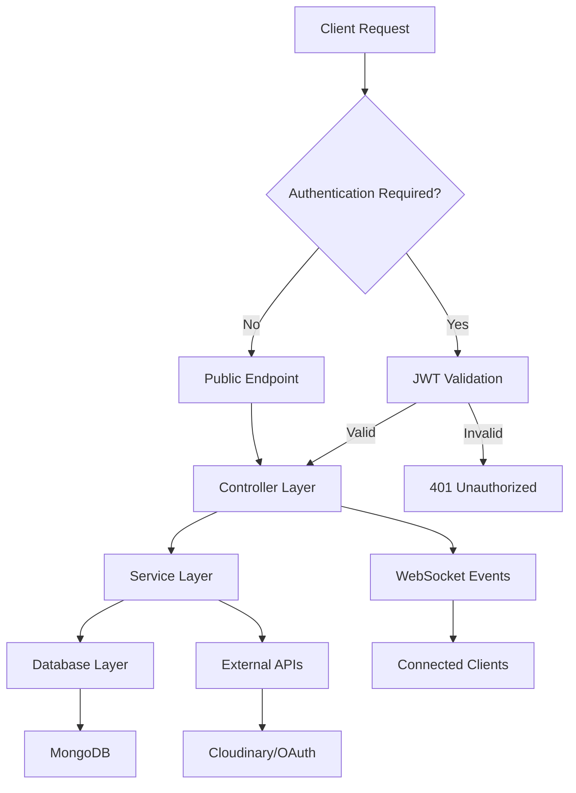

# Node.js TypeScript MVC Backend - Product Requirements Document

## 1. Product Overview
A comprehensive Node.js backend API built with TypeScript following MVC architecture pattern, providing authentication, file management, real-time communication, and data persistence capabilities.

The system serves as a robust foundation for web applications requiring user management, secure file uploads, real-time features, and scalable data operations with MongoDB integration.

## 2. Core Features

### 2.1 User Roles
| Role | Registration Method | Core Permissions |
|------|---------------------|------------------|
| Guest User | No registration required | Can access public endpoints only |
| Registered User | Email/OAuth registration | Can access protected routes, upload files, use real-time features |
| Admin User | Admin invitation/promotion | Full system access, user management, system monitoring |

### 2.2 Feature Module
Our backend system consists of the following main modules:
1. **Authentication Module**: JWT-based auth, OAuth integration, password management
2. **User Management Module**: Profile management, role-based access control
3. **File Upload Module**: Cloudinary integration, image/document processing
4. **Real-time Communication Module**: WebSocket connections, live notifications
5. **Data Management Module**: MongoDB operations, data validation, API endpoints
6. **Security Module**: CORS configuration, rate limiting, input sanitization

### 2.3 Page Details
| Module Name | Feature Name | Feature Description |
|-------------|--------------|--------------------|
| Authentication | JWT Authentication | Generate, validate, and refresh JWT tokens for secure API access |
| Authentication | OAuth Integration | Support Google, GitHub, and Facebook OAuth login flows |
| Authentication | Password Management | Secure password hashing, reset functionality with email verification |
| User Management | User Registration | Create new user accounts with email verification |
| User Management | Profile Management | Update user information, avatar upload, account settings |
| User Management | Role Management | Assign and manage user roles with permission-based access |
| File Upload | Image Upload | Upload and process images via Cloudinary with automatic optimization |
| File Upload | Document Upload | Handle document uploads with file type validation and storage |
| File Upload | File Management | List, delete, and organize uploaded files per user |
| Real-time Communication | WebSocket Server | Establish and manage WebSocket connections for live features |
| Real-time Communication | Live Notifications | Send real-time notifications to connected users |
| Real-time Communication | Chat System | Basic real-time messaging between users |
| Data Management | CRUD Operations | Complete Create, Read, Update, Delete operations for all entities |
| Data Management | Data Validation | Input validation using middleware and schema validation |
| Data Management | API Documentation | Auto-generated API docs with request/response examples |
| Security | CORS Configuration | Cross-origin resource sharing setup for frontend integration |
| Security | Rate Limiting | Prevent API abuse with configurable rate limiting |
| Security | Input Sanitization | Sanitize all user inputs to prevent injection attacks |

## 3. Core Process

### User Authentication Flow
1. User registers via email or OAuth provider
2. System sends verification email (for email registration)
3. User verifies account and receives JWT token
4. User accesses protected routes using Bearer token
5. Token refresh mechanism maintains session

### File Upload Flow
1. User authenticates and accesses upload endpoint
2. Multer middleware processes multipart form data
3. File validation checks type, size, and format
4. Cloudinary processes and stores the file
5. Database stores file metadata and user association
6. API returns file URL and metadata

### Real-time Communication Flow
1. Authenticated user establishes WebSocket connection
2. Server validates JWT token for WebSocket auth
3. User joins relevant rooms/channels
4. Real-time events broadcast to connected users
5. Connection management handles disconnections

## 4. User Interface Design
### 4.1 Design Style
- **API Response Format**: Consistent JSON structure with status, data, and message fields
- **Error Handling**: Standardized error codes and descriptive messages
- **Documentation Style**: OpenAPI 3.0 specification with interactive Swagger UI
- **Logging Format**: Structured JSON logs with timestamp, level, and context
- **Status Codes**: RESTful HTTP status codes (200, 201, 400, 401, 403, 404, 500)

### 4.2 API Design Overview
| Endpoint Category | Base Path | Response Format |
|------------------|-----------|----------------|
| Authentication | `/api/auth` | JWT tokens, user data, success/error messages |
| User Management | `/api/users` | User profiles, role information, operation status |
| File Operations | `/api/files` | File metadata, URLs, upload progress |
| Real-time | `/api/ws` | WebSocket connection endpoints and event schemas |
| Admin | `/api/admin` | System statistics, user management, configuration |

### 4.3 Responsiveness
The API is designed to be platform-agnostic, supporting web, mobile, and desktop clients through RESTful endpoints and WebSocket connections. Response times optimized for mobile networks with efficient data serialization and caching strategies.