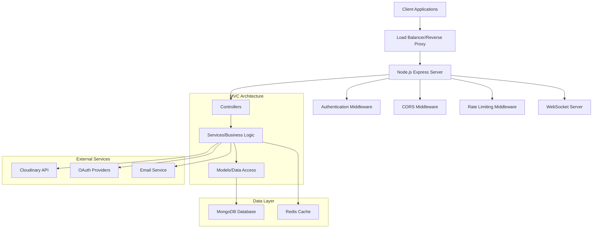
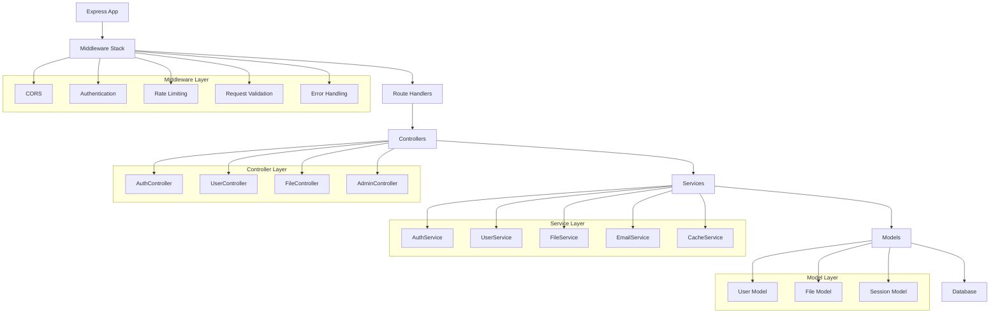
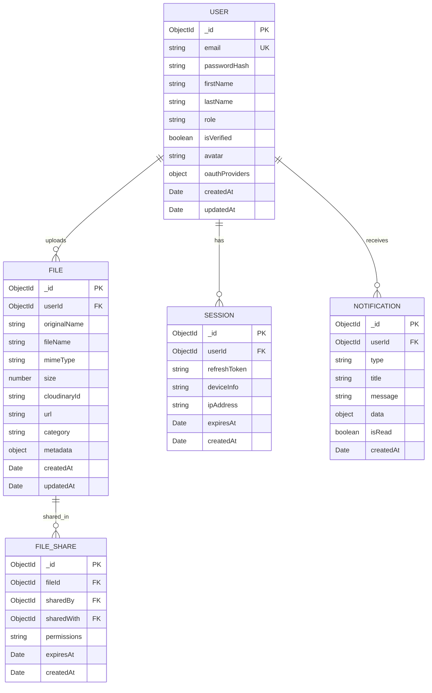

# Node.js TypeScript MVC Backend - Technical Architecture Document

## 1. Architecture Design



## 2. Technology Description

* Frontend: React/Vue/Angular (client-side, separate repository)

* Backend: Node.js\@20 + Express\@4 + TypeScript\@5

* Database: MongoDB\@7 with Mongoose ODM

* Authentication: JWT + Passport.js + OAuth 2.0

* File Storage: Cloudinary + Multer

* Real-time: Socket.io

* Caching: Redis

* Code Quality: ESLint + Prettier + Husky

* Testing: Jest + Supertest

* Documentation: Swagger/OpenAPI 3.0

## 3. Route Definitions

| Route                     | Purpose                                          |
| ------------------------- | ------------------------------------------------ |
| /api/auth/register        | User registration with email verification        |
| /api/auth/login           | User authentication and JWT token generation     |
| /api/auth/oauth/:provider | OAuth authentication (Google, GitHub, Facebook)  |
| /api/auth/refresh         | JWT token refresh                                |
| /api/auth/logout          | User logout and token invalidation               |
| /api/users/profile        | User profile management (GET, PUT)               |
| /api/users/avatar         | User avatar upload and update                    |
| /api/users/:id            | User details (admin access)                      |
| /api/files/upload         | File upload endpoint with Cloudinary integration |
| /api/files/list           | List user's uploaded files                       |
| /api/files/:id            | File operations (GET, DELETE)                    |
| /api/admin/users          | User management (admin only)                     |
| /api/admin/stats          | System statistics and monitoring                 |
| /ws                       | WebSocket connection endpoint                    |

## 4. API Definitions

### 4.1 Core API

**User Authentication**

```
POST /api/auth/register
```

Request:

| Param Name | Param Type | isRequired | Description                      |
| ---------- | ---------- | ---------- | -------------------------------- |
| email      | string     | true       | User email address               |
| password   | string     | true       | User password (min 8 characters) |
| firstName  | string     | true       | User first name                  |
| lastName   | string     | true       | User last name                   |

Response:

| Param Name | Param Type | Description                  |
| ---------- | ---------- | ---------------------------- |
| success    | boolean    | Registration status          |
| message    | string     | Success or error message     |
| user       | object     | User data (without password) |

Example Request:

```json
{
  "email": "user@example.com",
  "password": "securePassword123",
  "firstName": "John",
  "lastName": "Doe"
}
```

Example Response:

```json
{
  "success": true,
  "message": "Registration successful. Please check your email for verification.",
  "user": {
    "id": "64f8a1b2c3d4e5f6a7b8c9d0",
    "email": "user@example.com",
    "firstName": "John",
    "lastName": "Doe",
    "role": "user",
    "isVerified": false
  }
}
```

**User Login**

```
POST /api/auth/login
```

Request:

| Param Name | Param Type | isRequired | Description        |
| ---------- | ---------- | ---------- | ------------------ |
| email      | string     | true       | User email address |
| password   | string     | true       | User password      |

Response:

| Param Name   | Param Type | Description       |
| ------------ | ---------- | ----------------- |
| success      | boolean    | Login status      |
| token        | string     | JWT access token  |
| refreshToken | string     | JWT refresh token |
| user         | object     | User data         |

**File Upload**

```
POST /api/files/upload
```

Request (multipart/form-data):

| Param Name | Param Type | isRequired | Description                           |
| ---------- | ---------- | ---------- | ------------------------------------- |
| file       | file       | true       | File to upload                        |
| category   | string     | false      | File category (image, document, etc.) |

Response:

| Param Name | Param Type | Description           |
| ---------- | ---------- | --------------------- |
| success    | boolean    | Upload status         |
| file       | object     | File metadata and URL |

### 4.2 WebSocket Events

**Connection Events**

* `connect`: Client connects to WebSocket server

* `authenticate`: Client sends JWT for authentication

* `join_room`: Client joins a specific room/channel

* `leave_room`: Client leaves a room/channel

* `disconnect`: Client disconnects

**Message Events**

* `message`: Send/receive real-time messages

* `notification`: Send/receive notifications

* `user_status`: Broadcast user online/offline status

* `file_upload_progress`: Real-time file upload progress

## 5. Server Architecture Diagram



## 6. Data Model

### 6.1 Data Model Definition



### 6.2 Data Definition Language

**User Collection**

```javascript
// User Schema
const userSchema = new mongoose.Schema({
  email: {
    type: String,
    required: true,
    unique: true,
    lowercase: true,
    trim: true
  },
  passwordHash: {
    type: String,
    required: function() { return !this.oauthProviders || Object.keys(this.oauthProviders).length === 0; }
  },
  firstName: { type: String, required: true, trim: true },
  lastName: { type: String, required: true, trim: true },
  role: {
    type: String,
    enum: ['user', 'admin'],
    default: 'user'
  },
  isVerified: { type: Boolean, default: false },
  avatar: { type: String },
  oauthProviders: {
    google: { id: String, email: String },
    github: { id: String, username: String },
    facebook: { id: String, email: String }
  },
  lastLogin: { type: Date },
  isActive: { type: Boolean, default: true }
}, {
  timestamps: true,
  toJSON: { virtuals: true },
  toObject: { virtuals: true }
});

// Indexes
userSchema.index({ email: 1 });
userSchema.index({ 'oauthProviders.google.id': 1 });
userSchema.index({ 'oauthProviders.github.id': 1 });
userSchema.index({ 'oauthProviders.facebook.id': 1 });
```

**File Collection**

```javascript
// File Schema
const fileSchema = new mongoose.Schema({
  userId: {
    type: mongoose.Schema.Types.ObjectId,
    ref: 'User',
    required: true
  },
  originalName: { type: String, required: true },
  fileName: { type: String, required: true },
  mimeType: { type: String, required: true },
  size: { type: Number, required: true },
  cloudinaryId: { type: String, required: true },
  url: { type: String, required: true },
  category: {
    type: String,
    enum: ['image', 'document', 'video', 'audio', 'other'],
    default: 'other'
  },
  metadata: {
    width: Number,
    height: Number,
    format: String,
    colorSpace: String
  },
  isPublic: { type: Boolean, default: false },
  tags: [String]
}, {
  timestamps: true
});

// Indexes
fileSchema.index({ userId: 1, createdAt: -1 });
fileSchema.index({ category: 1 });
fileSchema.index({ tags: 1 });
```

**Session Collection**

```javascript
// Session Schema
const sessionSchema = new mongoose.Schema({
  userId: {
    type: mongoose.Schema.Types.ObjectId,
    ref: 'User',
    required: true
  },
  refreshToken: { type: String, required: true, unique: true },
  deviceInfo: {
    userAgent: String,
    platform: String,
    browser: String
  },
  ipAddress: String,
  expiresAt: { type: Date, required: true },
  isActive: { type: Boolean, default: true }
}, {
  timestamps: true
});

// TTL Index for automatic cleanup
sessionSchema.index({ expiresAt: 1 }, { expireAfterSeconds: 0 });
sessionSchema.index({ userId: 1 });
sessionSchema.index({ refreshToken: 1 });
```

**Initial Data Setup**

```javascript
// Create default admin user
const createDefaultAdmin = async () => {
  const adminExists = await User.findOne({ role: 'admin' });
  if (!adminExists) {
    const admin = new User({
      email: 'admin@example.com',
      passwordHash: await bcrypt.hash('admin123', 12),
      firstName: 'System',
      lastName: 'Administrator',
      role: 'admin',
      isVerified: true
    });
    await admin.save();
    console.log('Default admin user created');
  }
};

// Create indexes
const createIndexes = async () => {
  await User.createIndexes();
  await File.createIndexes();
  await Session.createIndexes();
  console.log('Database indexes created');
};
```

